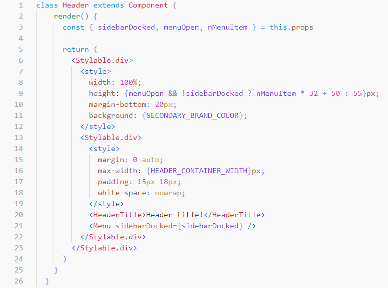

You can find a syntax highlighting extension for VSCode [here](https://github.com/adrgautier/vscode-css-in-jsx).

It is mostly written from [styled-components](https://github.com/styled-components/vscode-styled-components) VSCode extension. 

> ### ⚠ Important ⚠
> Like the <>CSS in JSX</> library itself, this is a proof of concept.
> It is not yet ready for been published as an extension for VSCode.

## Features

Provides syntax highlighting for your CSS in JSX.

## Known Issues

- autocompletion does not work
- style fragments in jsx expressions (`{ condition && <>property: value;</>`}) are not highlighted
- @media at-rules are not properly highlighted
- ...

## TODO

- fix the above issues
- remove useless SCSS grammar tokens
- publish the extension